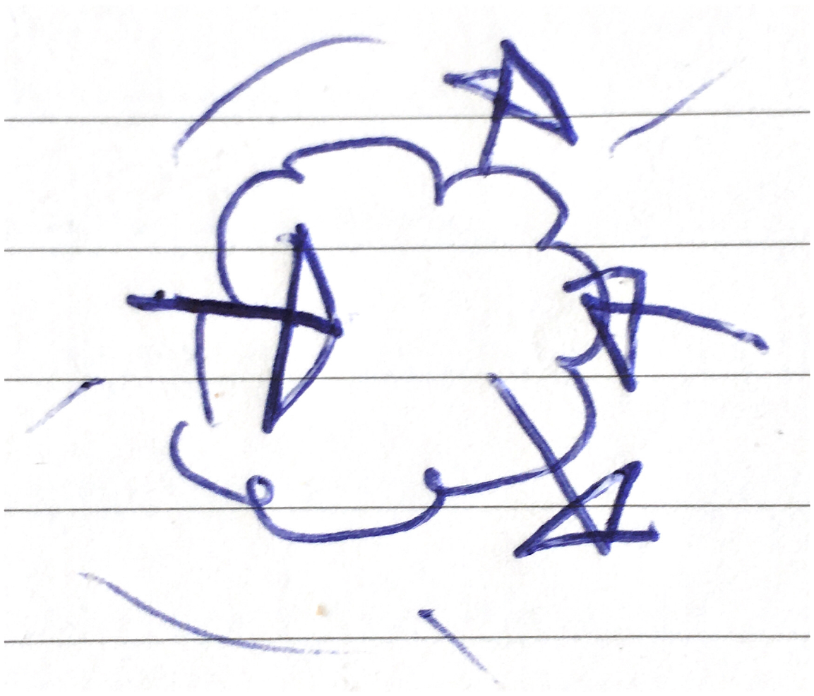

<div align="center">
	
	<h1>biog</h1>
	<p>
		<b>⚡︎ Performant and Lightweight Javascript EEG Data Converter ⚡︎</b>
	</p>
	<br>
</div>


[](https://drowzee.com/)

> This library acts as a converter and link between the multiple ways of storing EEG time series data in applications.

## Features

- Understands multiple JSON-type, csv and OpenBCI formats
- Works with `markers`

## Example

Convert from `Epoch` to multiple `Sample`'s

```ts
const epoch = {
  data: [
    [
      -911.1328125,
      ... // 7 more samples
    ],
    [
      -802.734375,
      ... // 7 more samples
    ],
    [
      251.953125,
      ... // 7 more samples
    ],
    [
      106.93359375,
      ... // 7 more samples
    ]
  ],
  info: { startTime: 1635707 }
};

const sampleFormat = biog.epochToSamples(epoch)

console.log(sampleFormat.length) // 8
console.log(sampleFormat)

// [
//   {
//     data: [-911.1328125,-802.734375,251.953125,106.93359375],
//     info: { startTime: 1635707 }
//   },
//   {
//     data: [-911.1328125,-802.734375,251.953125,106.93359375],
//     info: { startTime: 1635711 } // updated startTime
//   },
//   // ... 6 more samples
// ]

```

## Different kinds of data

Used by `eeg-pipes`:

```ts
type Sample = {
  data: number[];
  info: {
    startTime: number;
    samplingRate?: number;
    channelNames?: string[];
  };
};
```

Used by the neurosity device. Muse-js also has a similar format after using`zipSamples`.

```ts
type Marker = {
  label: string;
  timestamp: number;
};

type Epoch = {
  data: number[][];
  info: {
    startTime: number;
    samplingRate: number;
    channelNames: string[];
    markers?: Marker[];
  };
};
```

Used for storing a session as json:

```ts
type EEGSession = {
  samples: Sample[];
  channelNames: string[];
  samplingRate: number;
  markers: Marker[];
};
```
